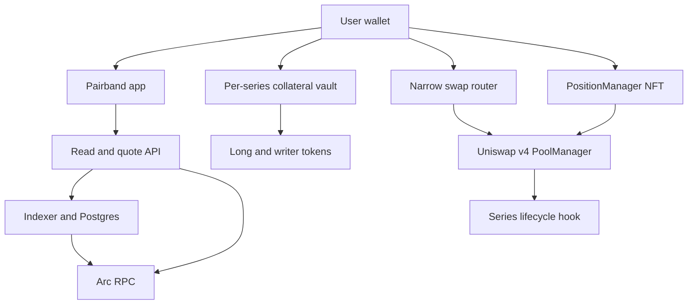

# Architecture and trust boundaries

The API prepares unsigned transactions; the wallet signs them. Vault backing never flows into PoolManager. The router trades long tokens and free USDC only. The hook checks registered series lifecycle; exercise and writer redemption call the vault directly. NFT liquidity withdrawals remain available when new trades stop. Indexing is an offchain view, not custody or settlement authority. Optional Circle funding and Graph analytics are adapters outside this core diagram.

Admin authority: register new series/pools and pause new risk. It cannot change issued terms, redirect existing collateral, mint unbacked claims, or suspend contractually valid exercise/redemption through a generic pause. Source/bytecode review must prove this. Stablecoin issuers and Arc runtime rules can independently restrict transfers; the protocol cannot promise to override them.

---
